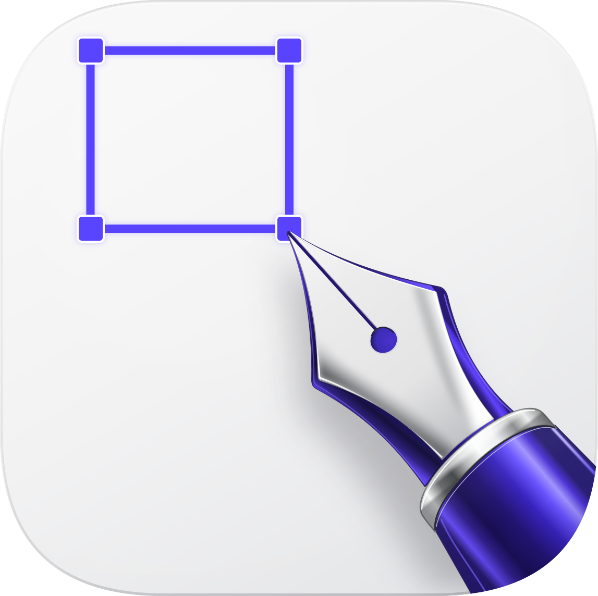
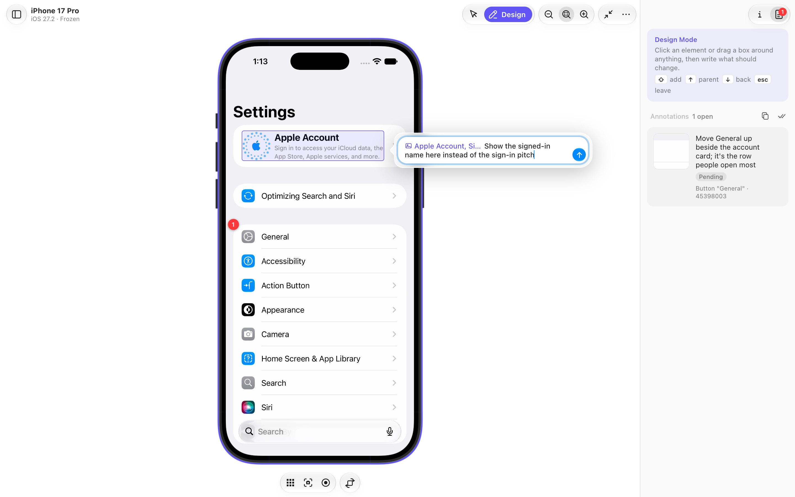
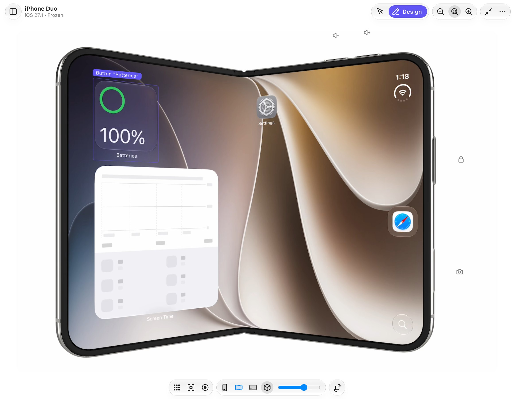

<div align="center">



# SimAgentation

Annotate a running iOS simulator in your browser, and hand the notes to your coding agent.


[Features](#features) | [Getting started](#getting-started) | [Design Mode](#design-mode) | [Connect an agent](#connect-an-agent) | [SDK](#simagentationplus-sdk) | [Configuration](#configuration)



</div>

SimAgentation is [Agentation](https://agentation.com) for iOS. Freeze the simulator's screen, click an element or drag a box around anything, and write what should change. Your agent gets the element, the screen it is on, strings to search the source for, and two screenshots: the whole screen with the box drawn in red, and a close-up of the box.

Your app needs no SDK. Everything comes from the simulator's accessibility tree, so it works with any app on any booted simulator, Apple's own included.

> [!NOTE]
> The native side uses Xcode's private CoreSimulator, SimulatorKit and AccessibilityPlatformTranslation frameworks, so a new Xcode release can break it until it's updated.

## Features

- **Design Mode**: hover to see elements, then click one or drag a box over any area. Shift adds more to the selection, and one note covers them all; ↑ and ↓ walk to the parent element and back.
- **Straight to your agent**: an MCP server with seven tools. In Claude Code, each annotation can land in a running session as you send it, an idle one included. Or copy every pending annotation as Markdown and paste it anywhere.
- **A page laid out like Xcode's Device Hub**: the device drawn with Xcode's own DeviceKit artwork, hardware buttons that slide out on hover, and Simulator.app's shortcuts. Simulators can be created, started, renamed, reset and removed from the page.
- **A hardware-encoded stream**: H.265 or H.264 from VideoToolbox, decoded by WebCodecs, at about 60 fps and 3–8 Mbit/s while scrolling. On Auto, the codec, resolution, bitrate and frame rate adapt to the browser and to what the connection carries.
- **iPhone Duo in 3D**: Xcode 27.1's foldable, drawn with Apple's own model and posed by its hinge, with Device Hub's pose picker and a hinge slider. Design Mode works on the bent screen too.
- **An optional SDK** for apps you build: exact selections, and the file and line each tagged view comes from.

## Getting started

You need macOS on Apple Silicon with Xcode 26 (27.1 for iPhone Duo).

With an agent, the [plugin](#connect-an-agent) is all you need: it brings SimAgentation along. On its own, install it with Homebrew:

```sh
brew install lcandy2/tap/sim-agentation
sim-agentation serve --open
```

`brew services start sim-agentation` keeps it running in the background instead.

To build from source you also need Node with [pnpm](https://pnpm.io). From the repo:

```sh
pnpm install
pnpm build    # the UI into app/web/dist, then the Swift binary
pnpm start    # app/host/.build/debug/sim-agentation serve --open
```

`app/scripts/package.sh` builds the release tarball the formula installs.

The page opens on http://localhost:38470. Pick a simulator on the left; one that isn't running shows a **Start** button, and nothing boots until you press it.

> [!TIP]
> While `pnpm start` runs, `pnpm dev` adds hot reload: the page on 38470 loads the UI from the Vite dev server on 38472, so edits show up without a reload.

## Using it

The page follows Xcode's Device Hub. The simulators sit on the left, with **+** to create one and a filter for all, running, iPhone and iPad. The device is in the middle, with Home, screenshot, screen recording (MP4) and rotate below it. The inspector on the right has two tabs: device info with the stream's settings, and your annotations. **…** holds everything else, from shutting down, renaming or resetting the simulator to Simulator.app's Device and Features menus.

In **Interact** mode you use the app: click and drag to touch, scroll with the wheel, type with the keyboard. A narrow window puts the device list away first, then the inspector, and brings them back when it widens.

### Design Mode

1. Press ⇧⌘D. The screen freezes and the accessibility tree loads.
2. Hover to see elements. ↑ selects the parent, ↓ goes back.
3. Click an element, or drag a box over any area. Hold Shift to add to the selection.
4. Write what should change and press Return (⇧Return for a new line). The annotation shows up in the inspector, numbered on the screen. Click its number to open it again and change the note, or pick something else for it.
5. Press Esc to drop the selection, and again to go back to the live screen.

Rotated devices work too, and the screenshots go to the agent upright. Click **Copy** in the annotations tab to put every pending annotation on the clipboard as Markdown, for an agent without MCP.

### Shortcuts

| Keys | What they do |
|---|---|
| ⇧⌘D | Design Mode, in and out |
| `A`, `I` | Design Mode, Interact |
| ↑ ↓ | The parent element, and back (Design Mode) |
| ↩ | Add the note (⇧↩: a new line) |
| Esc | Drop the selection, then leave Design Mode |
| `S` | Compare the SDK's view tree with the pixel fallback |
| ⌘S, ⌘R, ⌃⌘C | Save, record or copy the screen |
| ⇧⌘H, ⌘L | Home, lock |
| ⌘← ⌘→ | Rotate left, right |
| ⌘↑ ⌘↓ | Volume up, down |
| ⌘=, ⌘-, ⌘4 | Zoom in, out, fit |

The rest of Simulator.app's shortcuts (shake, appearance, text size, Face ID) work too; **…** lists them all.

### The stream

The stream picks its codec on its own: H.265, else H.264, else JPEG, taking the first this browser decodes in hardware, and moving on if the host can't encode it or nothing decodes within a few seconds. Video runs at about 60 fps, the simulator's own rate, at 3–8 Mbit/s while scrolling, against about 85 Mbit/s for JPEG.

On Auto, resolution, bitrate and frame rate follow too ([`auto.js`](app/web/src/lib/auto.js)). Once a second the host reports how far behind the viewer is, and the page how late that report arrived, which also catches a backlog in a tunnel or proxy. When either grows, the bitrate drops to what got through, then the resolution halves, then the frame rate drops to 30 fps. While anything is held back, the host pads the stream briefly to test for room, so a connection that recovers is used again within seconds. A hidden tab gets 5 fps. The info tab shows what's running and why, and lets you pin a codec, turn on 4:2:2 chroma for H.265, halve the resolution or set the bitrate.

### iPhone Duo



Xcode 27.1's foldable is drawn as Device Hub draws it: Apple's own model from Xcode, rendered on the Mac with RealityKit and streamed like the screen. The hinge poses the book. The stream follows whichever of its two panels is lit, and touches and the chrome go with it. Under the device sit Device Hub's pose picker (closed, open, flat) and a hinge slider; the cube button shows the lit panel flat in its chrome instead.

Touches land on whichever half of the bent screen they hit. In Design Mode, boxes and labels lie on the screen in perspective, cut along the hinge, and a half turned more than 60° away from you is left out. Fold it while annotating and the screen goes live, then freezes again once the hinge settles. The screenshots that go to the agent are of the screen itself, flat and upright.

Folding and turning go through a small helper that runs inside the simulator and sends the HID events Device Hub sends, and so do the hardware keys. The host builds it from [`app/host/Guest/HingeControl`](app/host/Guest/HingeControl) the first time it's needed.

## Connect an agent

An agent takes two things from SimAgentation: the MCP server, which hands it your annotations, and two skills that teach it to work through them. The plugin brings both, and SimAgentation itself, to Claude Code, Codex and Cursor; any other agent takes the skills and the server on their own.

### Claude Code, Codex and Cursor: the plugin

This repository is a plugin marketplace for all three.

```sh
# Claude Code
/plugin marketplace add lcandy2/sim-agentation
/plugin install sim-agentation@sim-agentation

# Codex
codex plugin marketplace add https://github.com/lcandy2/sim-agentation.git
codex plugin add sim-agentation@sim-agentation
```

In Cursor, add the plugin from this repository as [Cursor's guide](https://cursor.com/docs/plugins#installing-plugins) describes.

The first time the plugin's MCP server starts, it downloads the SimAgentation release that matches the plugin (about 2 MB), checks it against the release's SHA-256, and keeps it in `~/Library/Caches/sim-agentation`. An installed copy of the same version, from Homebrew for instance, is used instead, and `SIM_AGENTATION_BIN` points it at a build of your own. The server also starts the page on http://localhost:38470 when it isn't running; open it in your browser.

### The skills: npx skills

The [skills CLI](https://github.com/vercel-labs/skills) installs them into Claude Code, Codex, Cursor and the other agents it supports:

```sh
npx skills add lcandy2/sim-agentation                          # both skills
npx skills add lcandy2/sim-agentation --skill sim-agentation   # one of them
npx skills add lcandy2/sim-agentation -a claude-code -a codex  # for these agents only
```

They live in [`skills/`](skills). `sim-agentation` works through annotations: what each line of one tells the agent, how to find code whose label was built at runtime, and when to reply instead of editing. `sim-agentation-sdk` adds the SDK to an app, with a script that adds the package to a plain `.xcodeproj`.

### The MCP server

```sh
claude mcp add sim-agentation -- sim-agentation mcp
codex mcp add sim-agentation -- sim-agentation mcp
```

Any client that runs a stdio MCP server takes the same command. The server starts the web server if it isn't running. From a source build, the command is `/path/to/Sim-Agentation/app/host/.build/debug/sim-agentation mcp`.

### Annotations as you send them

In Claude Code, each annotation can land in a conversation as you send it: start or resume it with the server, added with `claude mcp add`, as a channel. An idle session takes them too, with no `sim_watch` loop:

```sh
claude --dangerously-load-development-channels server:sim-agentation
claude --resume <session> --dangerously-load-development-channels server:sim-agentation
```

> [!IMPORTANT]
> Channels are a Claude Code research preview. Until a channel is on Anthropic's allowlist it needs this flag and a confirmation at startup, and it needs a claude.ai login or a Console API key. Without the flag the pushes are dropped and the tools work as before.

If several sessions get the same annotation, the first to acknowledge it takes it on, and the others are told to leave it.

### Tools

| Tool | What it does |
|---|---|
| `sim_get_pending` | Pending annotations, with element info and screenshot paths |
| `sim_get_all` | All annotations, finished ones included |
| `sim_watch` | Waits until you add an annotation, then returns the pending list |
| `sim_acknowledge` | Marks one as in progress, for this session alone |
| `sim_resolve` | Marks one as fixed, with a summary |
| `sim_dismiss` | Declines one, with the reason |
| `sim_reply` | Posts a message on one |

Status changes and replies show up in the browser's inspector.

## SimAgentationPlus SDK

Add SimAgentationPlus to an app you build yourself for exact selections and source locations. Everything compiles out of Release builds.

It builds for every Apple platform: iOS and iPadOS 17, Mac Catalyst 17, macOS 14, tvOS 17, watchOS 10 and visionOS 1, or later. Where UIKit draws the interface it walks the views and layers; on macOS and watchOS it reports the `.simTag()` views only.

In Xcode, choose **File > Add Package Dependencies**, enter `https://github.com/lcandy2/sim-agentation`, and add SimAgentationPlus, the package's one library, to your app target. In a `Package.swift`:

```swift
.package(url: "https://github.com/lcandy2/sim-agentation", from: "0.2.1"),
// in your target's dependencies:
.product(name: "SimAgentationPlus", package: "sim-agentation"),
```

Then start it once and tag the views you want to find:

```swift
import SimAgentationPlus

RootView()
    .simAgentation()      // starts a local inspector on 127.0.0.1:38471 (Debug only)

ShowRow(show: show)
    .simTag()             // selectable as ShowRow, from ContentView.swift:34
```

UIKit needs less: every view class your app defines is selectable by name, even without a background, and each annotation names the view controller that owns it. Tag a view to add its source location:

```swift
let card = TicketCardView(show: show).simTag()   // TicketCardView, from TicketViewController.swift:21
```

When the app in front has the SDK, parents come from the real view and layer tree instead of pixels, so backgrounds that barely differ from the page still work. Each annotation also gets the app's bundle ID, a `Source` line with the tagged view's file and line, the owning view controller, and the app-defined view classes around the box. Press `S` or click **SDK** while annotating to compare with the pixel-only fallback. [`assets/examples/DemoApp`](assets/examples/DemoApp) is a small app with the SDK in place.

## Configuration

| Variable | Default |
|---|---|
| `SIM_AGENTATION_PORT` | `38470` |
| `SIM_AGENTATION_HOME` | `sim-agentation` in the temporary directory: annotations and their screenshots, kept through a restart of the host but not of the Mac |
| `SIM_AGENTATION_WEB` | the repo's `app/web/` directory (the UI) |
| `SIM_AGENTATION_SDK_URL` | `http://127.0.0.1:38471` |

Rendered device chrome is cached in `~/Library/Caches/sim-agentation`.

## How it's built

One Swift binary, built from `app/host/`, runs everything. It serves the page and its API from `app/web/dist`, speaks MCP, and drives the simulator through a native bridge that streams the screen, sends input and reads the accessibility tree.

| Path | What's there |
|---|---|
| [`app/host/Sources/sim-agentation`](app/host/Sources/sim-agentation) | The server, the MCP server, stream sessions, iPhone Duo and its 3D scene |
| [`app/host/Sources/SimBridge`](app/host/Sources/SimBridge) | The simulator bridge: screen capture, encoding, input, accessibility |
| [`app/host/Guest/HingeControl`](app/host/Guest/HingeControl) | The helper that runs inside the simulator for iPhone Duo |
| [`app/web/src`](app/web/src) | The Svelte UI, built by Vite into `app/web/dist` |
| [`Sources/SimAgentationPlus`](Sources/SimAgentationPlus) | The optional in-app SDK, packaged by the root [`Package.swift`](Package.swift) |
| [`assets/examples/DemoApp`](assets/examples/DemoApp) | A sample app that uses the SDK |
| [`skills`](skills) | Agent skills for working through annotations and for adding the SDK |

Without `pnpm dev`, the page runs `app/web/dist`; `pnpm build` or `pnpm watch` refreshes it. The dev server leaves a token for the host to pass the page, and the page loads from it only when they match, so nothing else on port 38472 can.

## Limits

- Without the SDK it doesn't know which source file a view comes from. The agent searches for the labels and identifiers it is given.
- Content without accessibility data, such as custom Canvas or Metal drawing, can only be annotated with a box.

## Credits

SimAgentation is released under the [Apache License 2.0](LICENSE). [NOTICE](NOTICE) names the work it adapts.

The simulator code in `app/host/Sources/SimBridge` is adapted from [baguette](https://github.com/tddworks/baguette) by tddworks, under the Apache License 2.0 (`app/host/Sources/SimBridge/LICENSE-baguette`), and so is the iPhone Duo support (`Foldable.swift`, `Guest.swift` and `Device3D.swift` in `app/host/Sources/sim-agentation`, and the guest helper in `app/host/Guest/HingeControl`). The streaming pipeline follows baguette's. Recovering collapsed accessibility children (`CollapsedChildrenRecovery.swift`) is adapted from [sim-use](https://github.com/lycorp-jp/sim-use) by LY Corporation, under the Apache License 2.0 (`app/host/Sources/SimBridge/LICENSE-sim-use`), and restarting a stale accessibility bridge follows [idb](https://github.com/facebook/idb). Each adapted file notes what changed.
